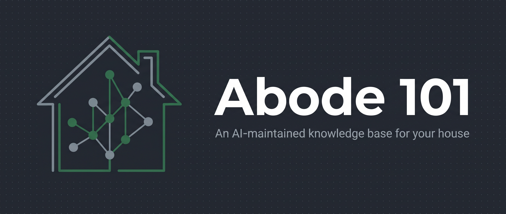

<p align="center">
  
</p>

<p align="center">
  
  
  
  
</p>

# Abode 101

**A knowledge base for your house.** Capture what you buy, learn, or discover about your
home; chat with it for exact details ("what's the battery for the dimmer?"); let an
overnight loop research new purchases and surface maintenance reminders.

It's the [**Open Knowledge Format**](#background-the-okf--llm-wiki-pattern) (Google's OKF /
Karpathy's "LLM wiki") pointed at your house — a folder of Markdown an AI keeps tidy. No app,
no database. The front end is chat; the storage is this folder.

> **This repo is the framework, not anyone's house.** The structure, the agent contract, and
> the playbooks are public and reusable. Real house data (items, schedules, manuals) is
> **gitignored** — fork it and fill it with your own home.

## What it looks like

Point any LLM/agent at the folder (it reads `AGENTS.md` + `index.md` first), then ask:

```
you ▸ what's the battery for the entry dimmer?
abode ▸ Panasonic CR2032 — per the manual (items/entry-dimmer.md, manual p.10).

you ▸ what size is the kitchen toe-kick vent?
abode ▸ Not recorded — it's marked TODO (needs measuring). I won't guess.

you ▸ how old is the water heater?
abode ▸ Installed 2019-04, so about 7 years (items/water-heater.md).

you ▸ what maintenance is coming up?
abode ▸ From maintenance/schedule.md: HVAC filter (90 days), smoke alarms
        (10-yr replace, 2027)… intervals without a cited source stay TODO.
```

The point isn't just recall — it's that it answers with a **source** and **refuses to guess**
when it doesn't know. House facts have to be right.

## Why a folder, not a database
One concept per file, links between files, an `index.md` the model reads first. Connections
are built once at capture time, not re-derived per query. It's portable, diffable,
model-agnostic, and you own it. The exact-facts **provenance & trust model** (every fact
carries a source + confidence tier) lives in [`AGENTS.md`](AGENTS.md).

## Background: the OKF / LLM-wiki pattern
Abode 101 is a home-specific take on a pattern that emerged in 2026:

- **Andrej Karpathy's "LLM wiki"** (April 2026) — instead of RAG over chunked documents,
  keep a folder of Markdown the LLM itself writes and maintains. Connections are built once at
  write time, not re-derived per query. → [the original gist](https://gist.github.com/karpathy/442a6bf555914893e9891c11519de94f)
- **Google Cloud's Open Knowledge Format (OKF)** (v0.1, June 12 2026) — a vendor-neutral spec
  that formalizes the pattern: a directory of UTF-8 Markdown files, each a single concept with
  YAML frontmatter (only `type` required), readable by humans and any agent with no database or
  SDK. → [OKF SPEC.md](https://github.com/GoogleCloudPlatform/knowledge-catalog/blob/main/okf/SPEC.md)
  · [Google Cloud blog](https://cloud.google.com/blog/products/data-analytics/how-the-open-knowledge-format-can-improve-data-sharing)

**How Abode 101 relates.** It follows the OKF shape (one concept per file, frontmatter, an
`index.md`, links) and Karpathy's "the AI maintains it" loop — and adds the two things the bare
format leaves out:
1. **The maintenance loop** ([`playbooks/`](playbooks/)) — capture, ingest from *any* source
   (manuals, receipts, photos, Amazon listings), an overnight web-research pass, and reminders.
   OKF standardizes the *files*; the playbooks keep them *fresh*.
2. **A provenance & trust model** ([`AGENTS.md`](AGENTS.md)) — every exact fact carries a source
   and a confidence tier, so the base answers with a citation and refuses to guess.

## Layout
| Path | What's in it | Public? |
|---|---|---|
| [`AGENTS.md`](AGENTS.md) | The contract: how to read/write, the trust model, link rules | ✅ |
| [`playbooks/`](playbooks/) | capture · ingest (any source) · overnight-research · reminders | ✅ |
| [`docs/`](docs/) | [scaffold ideas](docs/ideas.md) · [example prompts](docs/example-prompts.md) | ✅ |
| [`evals/`](evals/) | prompt/expect cases — does it answer exactly & refuse to guess? | ✅ harness |
| `areas/` `systems/` `items/` | your house, one thing per file (`_EXAMPLE.md` shows the format) | examples |
| `maintenance/` | filter/battery/seasonal schedule (`schedule.template.md`) | template |
| `resource_intake/` | raw inbox — drop PDFs/photos/receipts; `ingest.md` files them | README |
| `index.md` / `log.md` | your live map + event stream (start from `*.template.md`) | gitignored |

## Quick start
1. **Fork / clone**, then `cp index.template.md index.md` and `cp log.template.md log.md`.
2. Create `OWNER.local.md` with your name and Amazon Associates tag (gitignored).
3. Drop a manual / receipt / photo into `resource_intake/`, or just tell your agent "I bought X".
4. Point your LLM at [`AGENTS.md`](AGENTS.md) and ask it to capture / ingest.
5. Ask your house things: *"what filter does the fridge take?"*, *"what's due this month?"*

See [`docs/ideas.md`](docs/ideas.md) for a capture checklist and [`docs/example-prompts.md`](docs/example-prompts.md)
for usage patterns. Contributions to the framework welcome — see [CONTRIBUTING.md](CONTRIBUTING.md).

## License
[MIT](LICENSE) © Hans Scharler. Built in the open; share your own scaffolds back.
